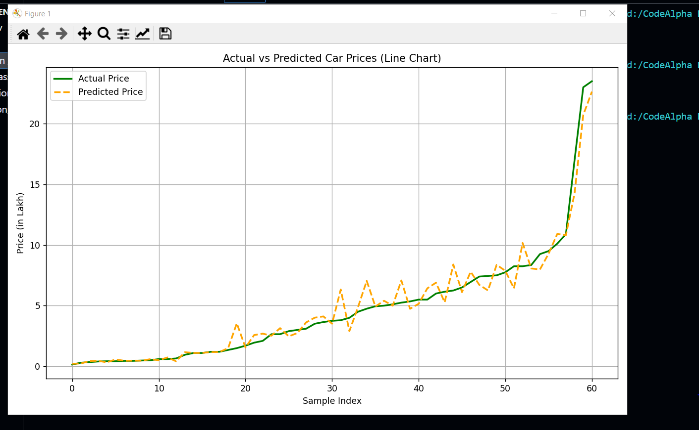
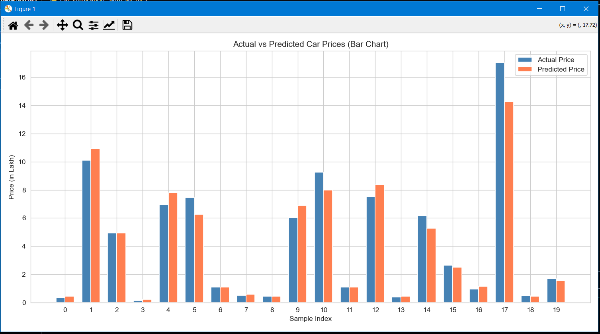
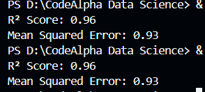

# 🚗 Car Price Prediction - Machine Learning Project

## ✅ Task Overview

**TASK 01: Car Price Prediction with Machine Learning**

This project uses regression techniques to predict car prices based on features like brand value, mileage, fuel type, transmission, and horsepower. It demonstrates the practical use of machine learning in real-world price estimation scenarios.

---

## 📊 Features

- Predicts car prices based on various attributes.
- Implements **data preprocessing** and **feature engineering**.
- Uses ML algorithms such as:
  - Linear Regression
  - Decision Tree Regressor
  - Random Forest Regressor
- Evaluates model performance using:
  - **R² Score**
  - **Mean Squared Error (MSE)**
- Data visualization using **Matplotlib** and **Seaborn**.

---

## 🧠 Machine Learning Concepts Covered

- Supervised learning (regression)
- Data cleaning and encoding
- Feature selection
- Model evaluation

---

---

## 🛠️ Libraries Used

- `pandas`
- `numpy`
- `matplotlib`
- `seaborn`
- `scikit-learn`

---

## 🔎 Dataset Features

Typical features used in the dataset include:

- Brand
- Year
- Fuel Type
- Transmission Type
- Engine Power (BHP)
- Mileage (km/l)
- Owner Type
- Number of Previous Owners
- Selling Price (Target)

---

✍️ Author
Muhammad Yasir
🌍 Pakistan
📧 [yaisikhan111@gmail.com]

📌 How to Run
Clone the repository:

bash
git clone https://github.com/your-username/Sapience-Car-Price-Prediction-Task-.git

